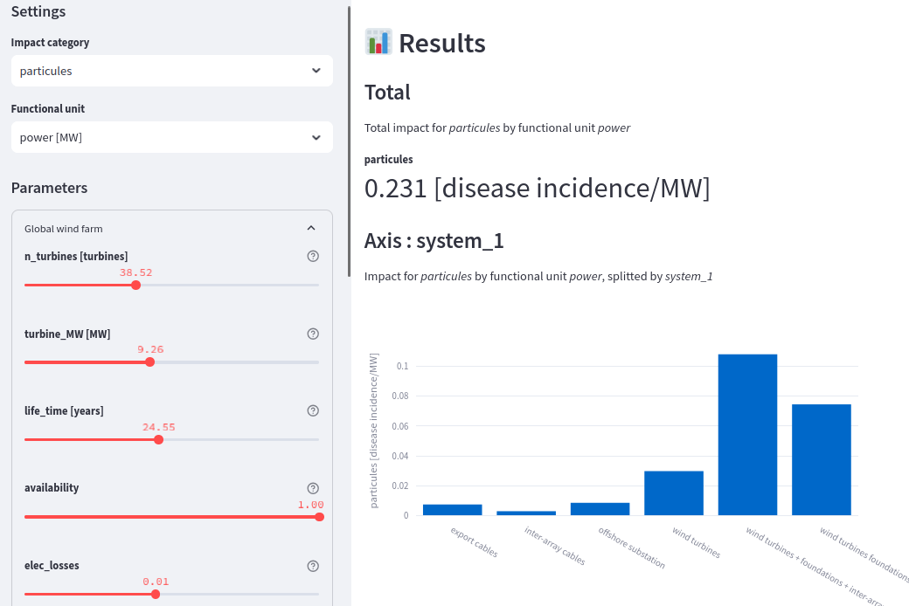

# lca_algebraic Web app Creator

This project automatically generates dynamic [Streamlit](https://streamlit.io/) web apps from [lca_algebraic](https://lca-algebraic.readthedocs.io/en/latest/) parametric inventories.  

It also provides a REST API for computing impacts.

Preview :



# Instructions

## 1) Build your inventory 

Run your code / notebook separately to create your *Brightway* project with lca_algebraic inventory in it.

Note that your code can be run in a separate python environment.

All that matter is the *Brightway* project, which will contain everything (activities, parameters) necessary to create the web 
app.

## 2) Install dependencies  

1. Create a separate Python environment (python 3.9 preferably) [with conda](https://conda.io/projects/conda/en/latest/user-guide/tasks/manage-environments.html) or [venv](https://docs.python.org/3/library/venv.html) 

2. Install the dependencies :
   > pip install -r requirements.txt


## 3) Fill the settings.yaml

Fill the info in [settings.yaml](./settings.yaml)

```yaml
title: Title of your project
icon: 🌬
project: BrightwayProjectName
database: ForegroundDatabaseName
root_activity: "name of the root activity of the inventory"

# List of impacts to consider
# This should refer key tuples of the impact categories.
# You can pick their name (climate_change, etc) as you wish
impacts:
    climate_change: ['EF v3.0','climate change','global warming potential (GWP100)']
    particules: ['EF v3.0','particulate matter formation','impact on human health']
    mineral_depletion: ['EF v3.0','material resources: metals/minerals','abiotic depletion potential (ADP): elements (ultimate reserves)']
  

# List of function units to consider
functional_units:
    gross_impact: # The name of each functional unit is up to you
        formula: 1
        unit: "-"

    installed_power: # The name of each functional unit is up to you
        formula: installed_power_mw * 1000 # formula can refer to lca_algebraic parameters
        unit: "kW"

    energy: # The name of each functional unit is up to you
        formula: installed_power_mw * 1000 * lifetime_year * 365 * 24 # formula can refer to lca_algebraic parameters
        unit: "kWh"

# List of axes to split impacts
# Can be an empty list if no axis is defined in the project.
# See : https://lca-algebraic.readthedocs.io/en/latest/notebooks/example-notebook.html#Split-impacts-along-axis
axes: ["phase"]
```

You may also adapt the file [static/header.md](static/header.md) with the description of your project.

## 4) Export the model 

Run the following command :
> python bin/export.py

This will create the file [data/model.json](data/model.json) containing all the formulas of the impacts.

## 5) Run the web app

Run the following command:
> streamlit run app.py


This will run your web app locally. Follow the instructions on the terminal to connect to it.

# 6) Deploy the app 

You may now publish your app freely on [streamlit community cloud](https://docs.streamlit.io/deploy/streamlit-community-cloud/deploy-your-app)
or [on your own cloud/server](https://docs.streamlit.io/deploy/tutorials).

You need to check that the **license** of your background database allows you to publish a web app. 

Technically, the web app is not linked to **Brightway** or any database anymore. The necessary impacts have been calculated once 
and integrated into algebraic formulas. Yet, some providers, like **ecoinvent** are very (unreasonably) restrictive about the 
usage of their data.

# REST API

In additional to the web app, a REST api is also deployed on `/api/compute_impact`.

It is only avalaible for self-hosted environment, not on the streamlit community server.

The RESt API takes the folloiwng query parameters in input :
* **method** : Impact method. One of those defined in `settings.yaml` 
* **functional_unit** : Functional unit. One of those define in `settings.yaml`
* **axis** : Optional axis. 'total' by default
* **<param_name>** : Any other query param is interpreted as a parameter of the model (as defined in `data\model.yaml`) 

**Example call**
``` 
http://localhost:8501/api/compute_impacts?method=Climate%20change&axis=part&functional_unit=Total%20Energy&Power_plant_lifetime=25
```

This REST API will compute **climate change impact**, per **kWh** (total energy), splitted by **parts** of the system. 
The **lifetime** of the system is set to **25 years**. All other parameters keep their default values.

**Result**

The REST API return a *json* doctionnary, with the physical unit of the result and the values, splitted by `axis` (if any)
```json
{ 
  "value": {
      "_other_": 0.0, 
      "mounting": 0.004573986013986014, 
      "elec_system": 0.0016992324756164101, 
      "transport": 0.000486564289044289, 
      "module": 0.015597616456714248
  }, 
  "unit": "kg CO2-Eq/kWh"}
```


# Copyright and license

This code is copyrighed by [Mines Paris PSL - OIE team](https://www.oie.minesparis.psl.eu/) and distributed under a [MIT license](./LICENSE) 


